# Deploy Third-Party & Open Models for use in the Gemini Enterprise app

Deploy AI agents powered by third-party models (Anthropic Claude) and open-source models (Google Gemma 4) for use in the [Gemini Enterprise app](https://cloud.google.com/products/gemini/enterprise) using [Agent Runtime](https://docs.cloud.google.com/gemini-enterprise-agent-platform/scale) and the [Agent Development Kit (ADK)](https://github.com/google/adk-python).

This guide walks through the end-to-end flow:
1. [Enable third-party models](#enable-claude-models-in-model-garden) in Model Garden
2. [Build and deploy](#deploy-to-agent-engine) an agent to Agent Runtime using ADK
3. [Add the agent to Gemini Enterprise](#add-the-agent-to-gemini-enterprise) so users in your organization can interact with it

## Prerequisites

1. A Google Cloud project with billing enabled
2. A [Gemini Enterprise](https://cloud.google.com/products/gemini/enterprise) subscription for your Google Workspace organization
3. [Agent Platform API](https://console.cloud.google.com/apis/library/aiplatform.googleapis.com) enabled
4. [Cloud Resource Manager API](https://console.developers.google.com/apis/api/cloudresourcemanager.googleapis.com/overview) enabled
5. For Claude: enable Anthropic models in [Model Garden](https://console.cloud.google.com/agent-platform/model-garden) (see [Enable Claude Models in Model Garden](#enable-claude-models-in-model-garden) below)
6. [gcloud CLI](https://cloud.google.com/sdk/docs/install) installed
7. Python 3.13+

## Enable Claude Models in Model Garden

Before using Claude models, you need to enable them in your Google Cloud project.

**Step 1.** In the Google Cloud Console, search for **Model Garden**.

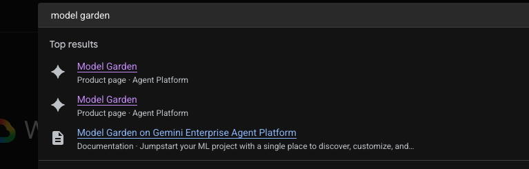

**Step 2.** In Model Garden, search for **Claude** to find the available Anthropic models.

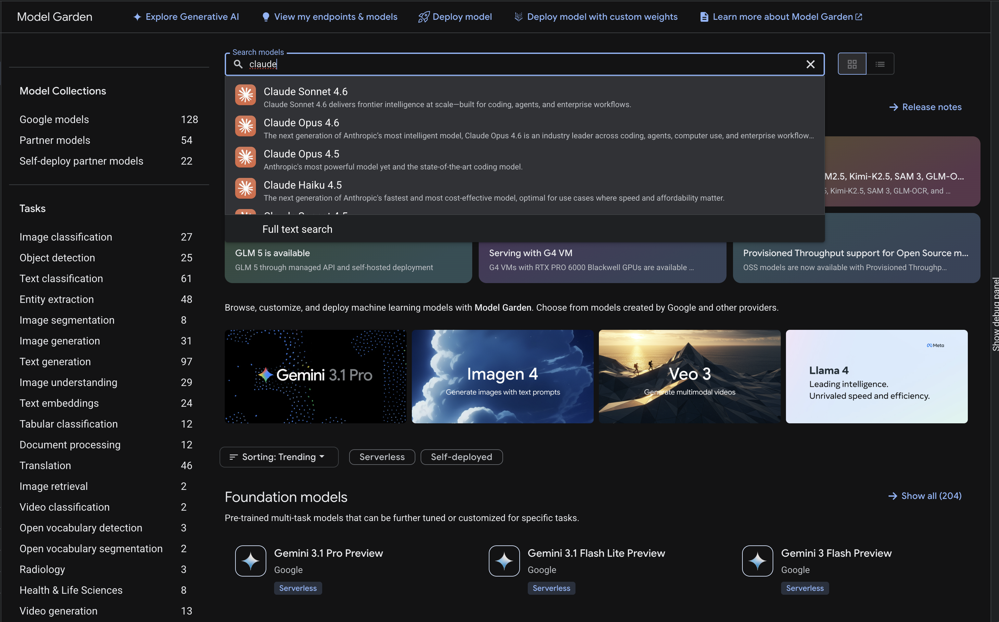

**Step 3.** Select a Claude model and fill out the enablement form with your business details.

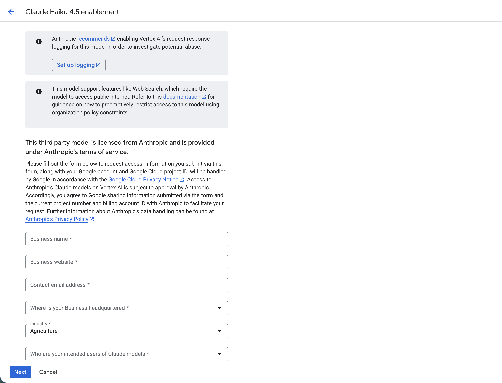

**Step 4.** Review the pricing and accept the terms and agreements, then click **Agree**.

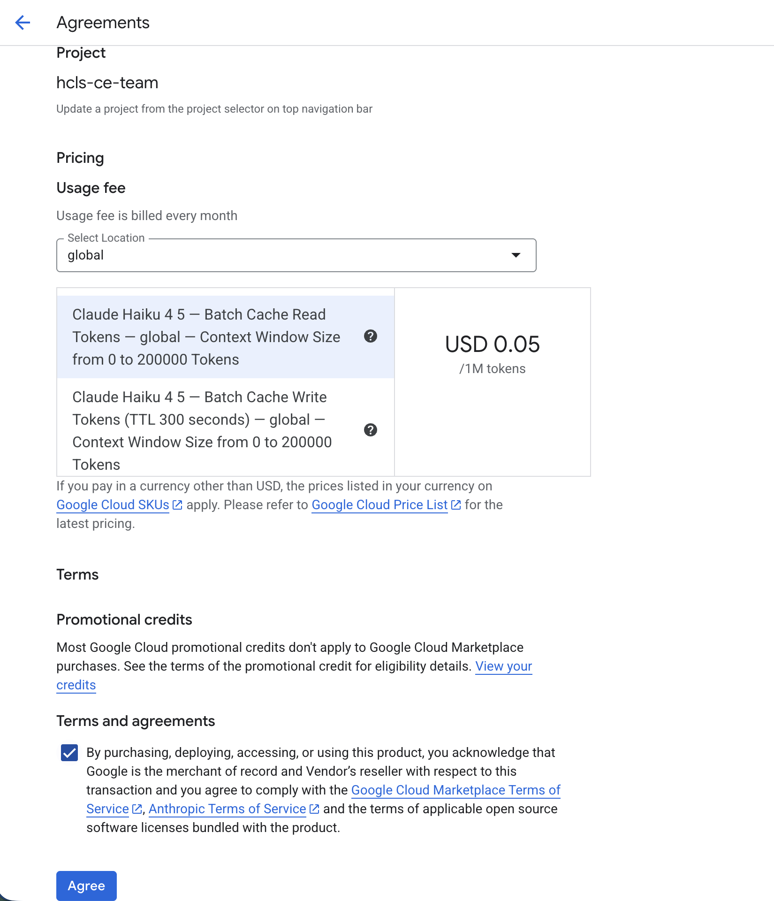

## Setup

### Install dependencies

Dependencies are automatically managed by `uv` when you use `uv run`. If you need to synchronize dependencies in your local environment manually, you can run:

```bash
uv sync
```

### Authenticate with Google Cloud

```bash
gcloud auth login
gcloud auth application-default login
gcloud config set project YOUR_PROJECT_ID
```

### Configure environment variables

Copy `.env.example` to `.env` and update `GOOGLE_CLOUD_PROJECT` with your Google Cloud Project ID:

```bash
cp .env.example .env
```

Open `.env` and replace `YOUR_PROJECT_ID` with your actual Google Cloud project ID.

## Agent Examples

### Claude (Anthropic via Agent Platform Model Garden)

Anthropic models are available in specific locations (e.g. `us-east5` or `global`). Since Agent Runtime doesn't support all of those locations, we deploy Agent Runtime to `us-central1` and override `GOOGLE_CLOUD_LOCATION` in `agent.py` to route model calls to the correct location.

See [`model_garden_agent/`](model_garden_agent/) for a working example.

```python
import os
from google.adk.agents.llm_agent import Agent

os.environ['GOOGLE_CLOUD_LOCATION'] = os.getenv('MODEL_LOCATION', 'global')

root_agent = Agent(
    model=os.getenv('MODEL_NAME', 'claude-opus-4-7'),
    name='root_agent',
    description='A helpful assistant for user questions.',
    instruction='Answer user questions to the best of your knowledge',
)
```

### Gemma 4 (Google Open Source)

[Gemma 4](https://ai.google.dev/gemma/docs) is Google's open-source model family. You can use it directly via the Gemini API with no region workarounds needed. Can also be deployed through model garden. 

```python
from google.adk.agents import LlmAgent
from google.genai.models import Gemini

root_agent = LlmAgent(
    model=Gemini(model="gemma-4-31b-it"),
    name='root_agent',
    description='A helpful assistant for user questions.',
    instruction='Answer user questions to the best of your knowledge',
)
```

## Project Structure

```
model-garden-on-gemini-enterprise/
├── pyproject.toml     # build configuration & dependencies
├── README.md          # setup & deployment guide
├── .env               # environment variables (project, location, etc.)
├── docs/              # documentation images
├── terraform/         # Terraform deployment configuration
│   ├── main.tf
│   ├── variables.tf
│   ├── outputs.tf
│   ├── README.md
│   └── modules/
│       └── model_garden_agent/
│           ├── main.tf
│           ├── variables.tf
│           └── outputs.tf
└── model_garden_agent/
    ├── __init__.py    # registers the agent
    └── agent.py       # agent logic & callbacks
```

## Test Locally

```bash
uv run adk web
```

## Deploy to Agent Runtime

Before deploying, compile the dependencies from `pyproject.toml` into a `requirements.txt` inside the agent directory:

```bash
uv pip compile pyproject.toml -o model_garden_agent/requirements.txt
```

Then deploy to Agent Runtime:

```bash
uv run adk deploy agent_engine \
    --project=YOUR_PROJECT_ID \
    --region=us-central1 \
    --display_name="Model Garden Agent" \
    --env_file=.env \
    model_garden_agent
```

On success:
```
✅ Created agent engine: projects/123456789/locations/us-central1/reasoningEngines/RESOURCE_ID
```

## Deploy with Terraform (Alternative)

For production, CI/CD pipelines, or when custom dependencies require custom container runtimes, you can deploy the agent using **Terraform** and a **Dockerfile**. This packages your agent logic, `Dockerfile` environments, OpenTelemetry endpoints, and IAM permissions in a single declarative deployment.

See the dedicated [Terraform Deployment README](terraform/README.md) for detailed instructions on variables, configuring standard service account fallbacks, and executing the flow.

### Quick Start
Ensure your project credentials are authenticated (`gcloud auth application-default login`), then run:
```bash
cd terraform
terraform init
terraform validate
terraform apply -var="project_id=YOUR_PROJECT_ID"
```

On success, copy the returned `reasoning_engine_id` outputs to query or register your agent.


### Verify in the Console

**Step 1.** In the Cloud Console, search for **Agent Runtime**.

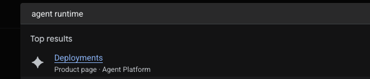

**Step 2.** You should see your deployed **Model Garden Agent** in the Agent Runtime console.

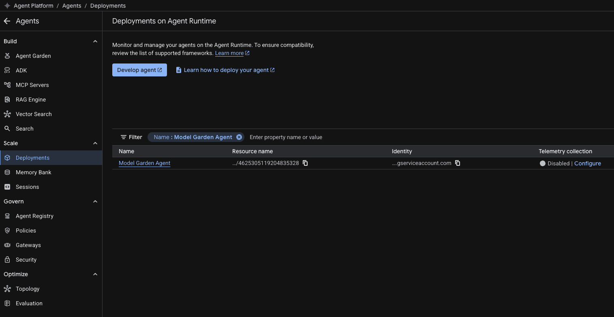

## Query the Deployed Agent

### Python

```python
import vertexai
from vertexai import agent_engines

vertexai.init(project="YOUR_PROJECT_ID", location="us-central1")

agent_engine = agent_engines.get("RESOURCE_ID")
session = agent_engine.create_session(user_id="test-user")
for event in agent_engine.stream_query(
    session_id=session["id"],
    message="Hello!",
    user_id="test-user",
):
    print(event)
```

### REST

```
POST https://us-central1-aiplatform.googleapis.com/v1/projects/YOUR_PROJECT_ID/locations/us-central1/reasoningEngines/RESOURCE_ID:streamQuery
```

## Add the Agent to Gemini Enterprise

Once your agent is deployed to Agent Runtime, you can make it available to users in your organization through the [Gemini Enterprise app](https://cloud.google.com/products/gemini/enterprise). This lets users interact with your custom agent alongside Google-made agents like Deep Research.

### Prerequisites

- A Gemini Enterprise subscription for your Google Workspace organization
- Admin access to the Gemini Enterprise admin console

### Steps

**Step 1.** In the Google Cloud console, go to the [Gemini Enterprise page](https://console.cloud.google.com/gemini-enterprise/), then navigate to **Apps > Gemini Enterprise > Agents**, and click **+ Add agent**.

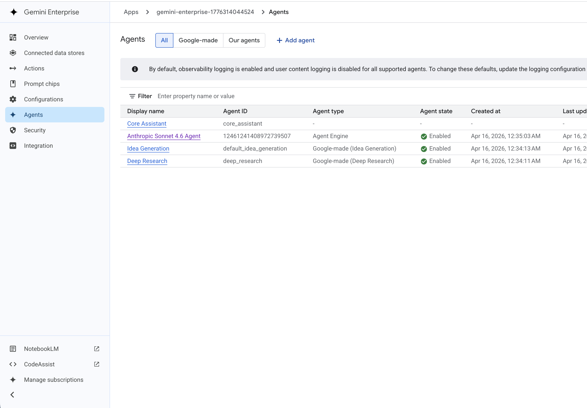

**Step 2.** In the "Add an agent" dialog, select **Custom agent via Agent Runtime** to connect your deployed agent.

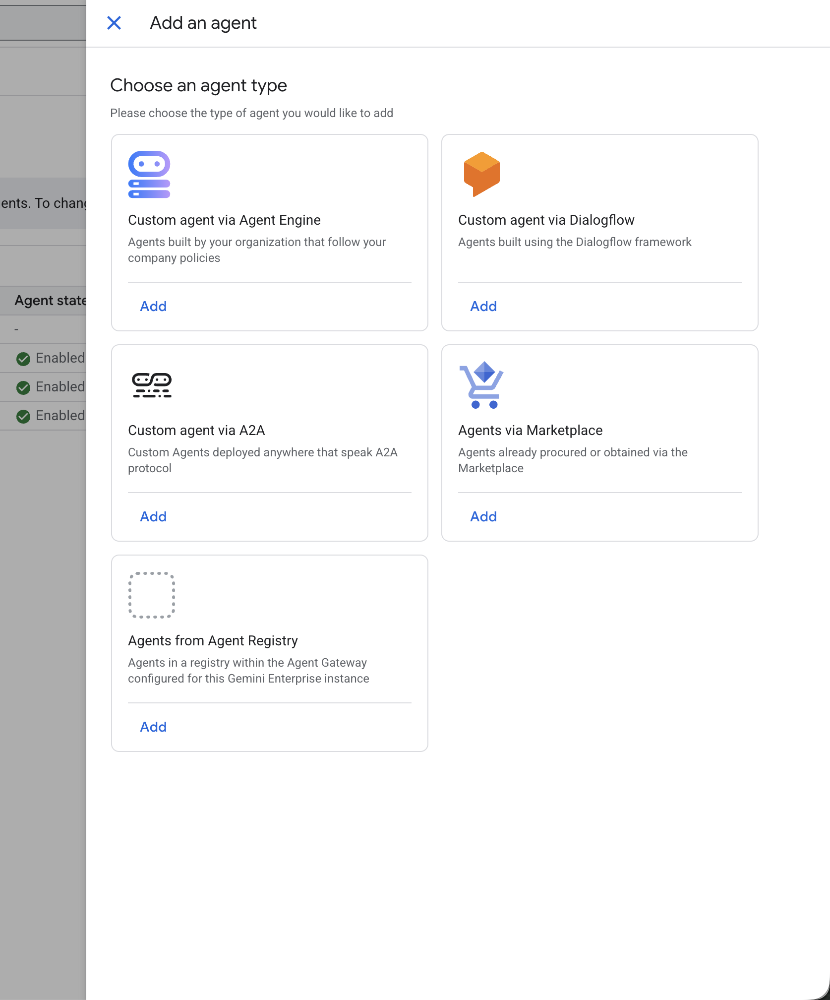

**Step 3.** Configure agent authorization. You can add OAuth or service account authorizations if your agent needs to access protected resources, or click **Skip** to proceed without authorization.

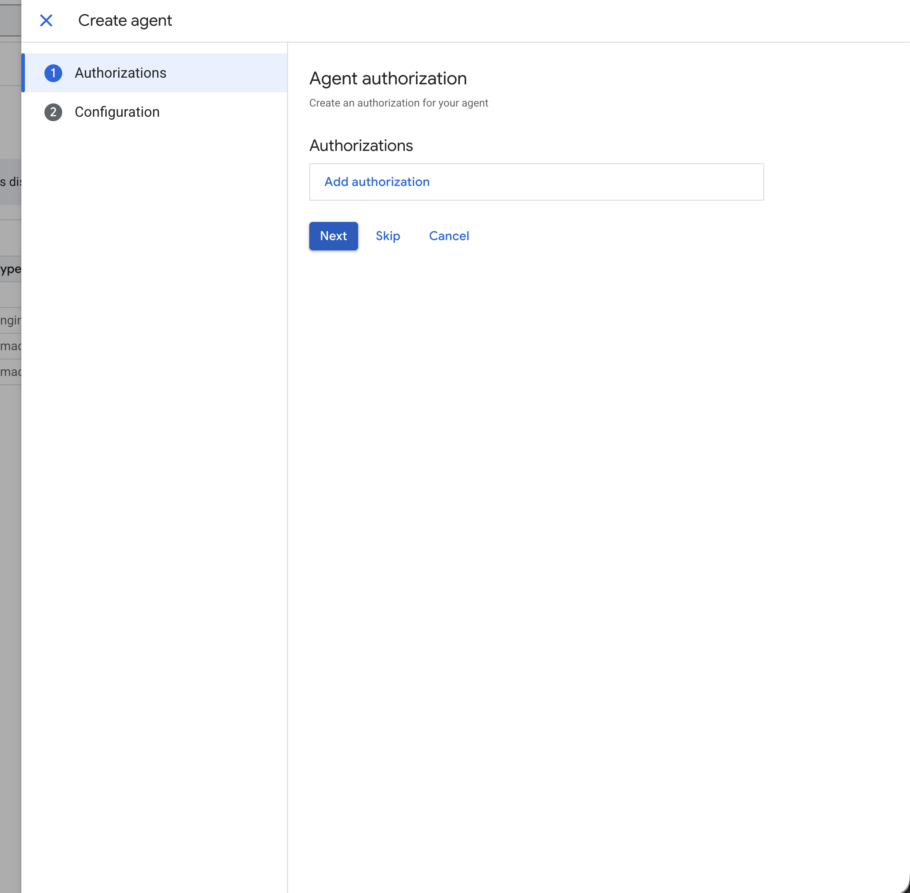

**Step 4.** Once created, the agent appears in the Gemini Enterprise agents gallery under **From your organization**, alongside Google-made agents.

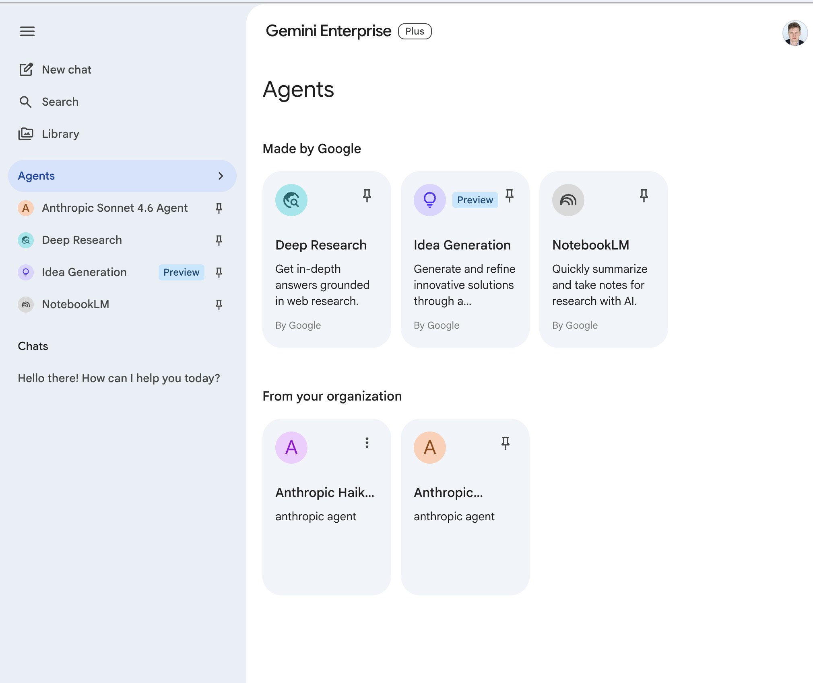

**Step 5.** Users in your organization can now select the agent from the sidebar and chat with it directly in Gemini Enterprise.

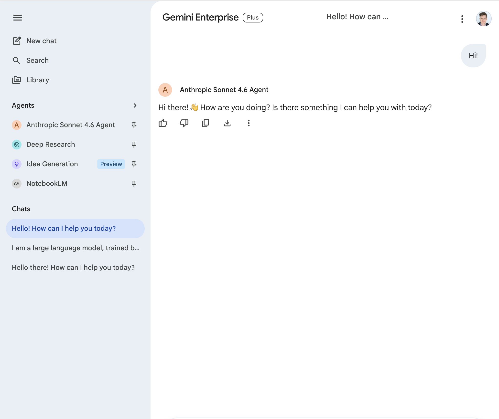

## Optional: Web Search

The agent ships with a [Web Grounding for Enterprise](https://docs.cloud.google.com/gemini-enterprise-agent-platform/models/grounding/web-grounding-enterprise) tool that's **commented out** by default. Enable it to give the agent access to a curated, compliance-controlled web index (no customer-data logging, VPC-SC compatible, 6–24 hour freshness) — appropriate for healthcare, finance, and public-sector workloads.

### What enabling it gives you

The tool is a regular Python `FunctionTool` whose implementation makes a Gemini call (`gemini-3.5-flash` by default; override with `SEARCH_MODEL_NAME` in `.env`) with `tools=[Tool(enterprise_web_search=EnterpriseWebSearch())]` and returns:

```python
{
    "answer": "...",                        # synthesized grounded text
    "citations": [{"title": "...", "uri": "..."}, ...],
    "suggested_queries": ["...", "..."],   # surface as "Suggested searches:"
}
```

Wrapping the grounding flag inside a Python function lets it work with **any planner model** and dispatches deterministically through ADK's normal function-call path — unlike the built-in `google_search` grounding tool, which is Gemini-only and bypasses function-call dispatch entirely (so wrapping it in an AgentTool sub-agent is flaky in practice).

The instruction addendum asks the model to inline citations as numbered references and to display `suggested_queries` under a "Suggested searches:" line, which satisfies the spirit of the [Google Search suggestions display requirement](https://docs.cloud.google.com/gemini-enterprise-agent-platform/models/grounding/web-grounding-enterprise#use-google-search-suggestions). (Note: GE's chat UI does not render the styled HTML chips from `searchEntryPoint.renderedContent`, so the queries are presented as plain text — this is best-effort given current GE rendering constraints.)

### Step 1 — uncomment the web search blocks in `agent.py`

Search for `=== OPTIONAL: Web search` / `=== OPTIONAL: Web Grounding for Enterprise` in [`agent.py`](agent.py). There are four contiguous blocks to uncomment (labeled in order): the imports, the `enterprise_web_search` function, the instruction addendum, and the `tools=[enterprise_web_search]` argument on `root_agent`.

### Step 2 — test

Local:

```bash
uv run adk web
```

Then redeploy:

```bash
uv run adk deploy agent_engine \
    --project=$PROJECT_ID \
    --region=us-central1 \
    --agent_engine_id=$ENGINE_ID \
    --display_name="Model Garden Agent" \
    --env_file=.env \
    model_garden_agent
```

Ask a current-events / regulatory question ("what's the latest 2026 FDA guidance on AI/ML medical devices?") and the agent should reply with cited text plus a Suggested searches line.

> **No new IAM required** — the existing Agent Engine service identity already has the permissions needed to call the grounding API.

## Monitor

View deployed agents in the [Agent Runtime Console](https://console.cloud.google.com/agent-platform/runtimes).

## Optional: Code Execution

The agent ships with a stateful Python sandbox integration ([Code Execution](https://docs.cloud.google.com/gemini-enterprise-agent-platform/scale/sandbox/code-execution-overview)) that's **commented out** by default. Enable it to let Claude write and run code (pandas, numpy, matplotlib, scikit-learn, openpyxl, PyPDF2, etc. preinstalled) for analyzing CSV / Excel / JSON / Parquet attachments alongside the PDFs and images Claude already reads natively.

The screenshots below are from a single GE turn where the user attached a research paper PDF and an `.xlsx` and asked for a brief summary plus a dashboard:

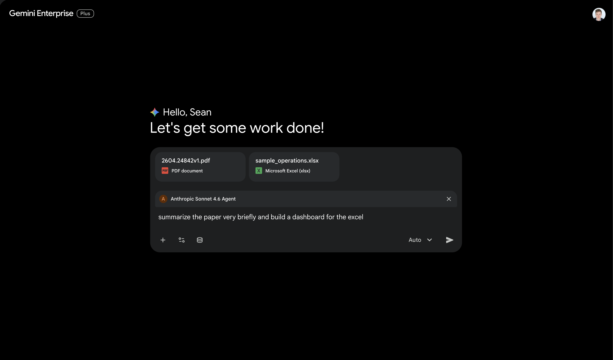
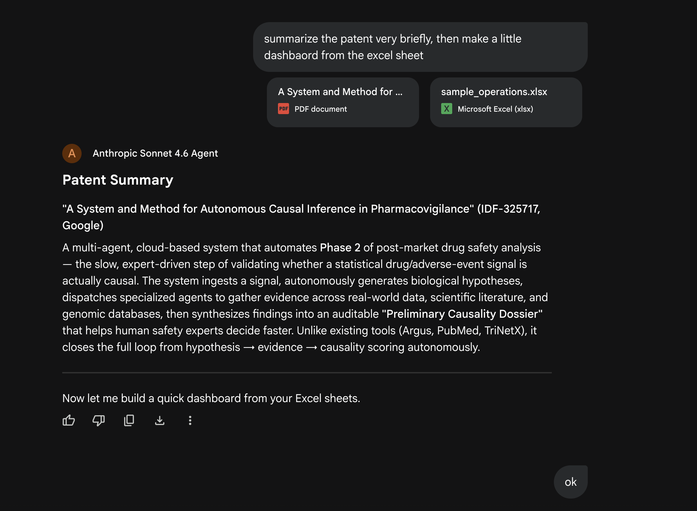
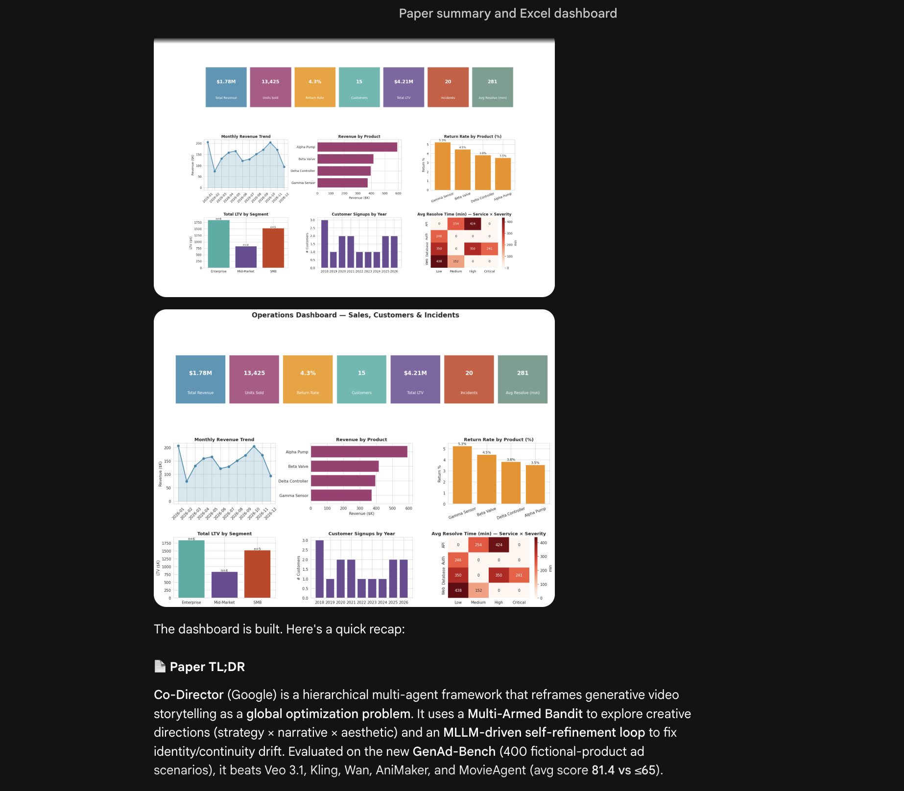

### What enabling it gives you
- Claude writes Python in fenced ```python blocks; the sandbox runs them and the output is fed back as `tool_output`. Multi-step analysis works because variables, imports, and loaded DataFrames persist across blocks within a session.
- Attached `.csv`, `.xlsx`, `.xls`, `.json`, `.parquet`, `.tsv` files are pushed into the sandbox's working directory by the agent's `before_model_callback` (ADK only auto-mounts CSV out of the box, so the agent extends that itself).

### Step 1 — create the sandbox (one-time)

Replace `PROJECT_ID`, `PROJECT_NUMBER`, and `ENGINE_ID` with your values. The sandbox is a child resource of your already-deployed Agent Engine:

```bash
PROJECT_ID="YOUR_PROJECT_ID"
PROJECT_NUMBER="YOUR_PROJECT_NUMBER"
ENGINE_ID="YOUR_REASONING_ENGINE_ID"

# Find PROJECT_NUMBER if you don't know it:
# gcloud projects describe "$PROJECT_ID" --format='value(projectNumber)'
# Find ENGINE_ID by listing your engines (look for "Model Garden Agent"):
# gcloud ai reasoning-engines list --region=us-central1 --project="$PROJECT_ID"

curl -sS -X POST \
  -H "Authorization: Bearer $(gcloud auth print-access-token)" \
  -H "Content-Type: application/json" \
  -d '{
        "displayName": "model-garden-claude-sandbox",
        "spec": {"codeExecutionEnvironment": {}},
        "ttl": "31536000s"
      }' \
  "https://us-central1-aiplatform.googleapis.com/v1beta1/projects/$PROJECT_ID/locations/us-central1/reasoningEngines/$ENGINE_ID/sandboxEnvironments"
```

The response contains the new sandbox's full resource name. Copy it into `.env`:

```
SANDBOX_RESOURCE_NAME=projects/PROJECT_NUMBER/locations/us-central1/reasoningEngines/ENGINE_ID/sandboxEnvironments/SANDBOX_ID
```

(For production, omit `SANDBOX_RESOURCE_NAME` and set `AGENT_ENGINE_RESOURCE_NAME=projects/.../reasoningEngines/ENGINE_ID` instead so each session gets its own sandbox.)

### Step 2 — grant the sandbox-execute IAM role

The Agent Engine service identity needs `roles/aiplatform.user` to call `sandboxEnvironments.execute`:

```bash
gcloud projects add-iam-policy-binding "$PROJECT_ID" \
  --member="serviceAccount:service-${PROJECT_NUMBER}@gcp-sa-aiplatform-re.iam.gserviceaccount.com" \
  --role="roles/aiplatform.user"
```

(Skip if the project already grants this. Takes ~1 min to propagate.)

### Step 3 — uncomment the code execution blocks in `agent.py`

Search for the marker `=== OPTIONAL: Code execution` in [`agent.py`](agent.py). There are five contiguous blocks to uncomment (they're labeled in order): the imports, the helpers + `_PatchedSandboxExecutor` class, the sandbox-routing pass inside the callback, the instruction addendum, and the `code_executor=` argument on `root_agent`.

> **Why patched?** ADK 1.32's `AgentEngineSandboxCodeExecutor` has two bugs in its input-file passthrough — wrong dict key (`contents` vs `content`) and base64-encoding bytes that the SDK forwards verbatim — so attached files arrive empty. The subclass fixes both.
>
> **Why `optimize_data_file=False`?** When `True`, ADK emits a synthetic `Processing input file: NAME` event before Claude responds. Gemini Enterprise renders that placeholder as the final answer and drops every subsequent event in the turn (including Claude's actual response). Routing data files through our own callback avoids the synthetic event entirely.

### Step 4 — test

Local:

```bash
uv run adk web
```

Then redeploy:

```bash
uv run adk deploy agent_engine \
    --project=$PROJECT_ID \
    --region=us-central1 \
    --agent_engine_id=$ENGINE_ID \
    --display_name="Model Garden Agent" \
    --env_file=.env \
    model_garden_agent
```

Attach any CSV/Excel/JSON/Parquet file in the local UI or in Gemini Enterprise and ask for an analysis ("what sheets are in this file?", "plot revenue per month", "build a dashboard").
